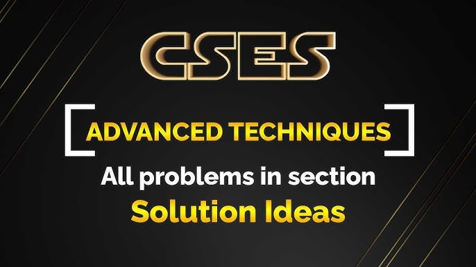

##  Introduction

**[CSES](https://cses.fi/problemset/) is one of the most reputated websites for learning data structures and algorithms by solving problems.Almost each problem is related to some kind of algorithm or data structure.**

**When it comes to competitive programming it is very important to learn new techniques by solving problems. But it is not guaranteed that each problem will teach you new concept. That is where CSES problemset comes into play. Giving you opportunity to learn new techniques by solving problems.**

**This repo contains solutions of  that I have solved.**

**You can find the problems on [CSES](https://cses.fi/problemset/) website.**

 

##  Topics

||Status|Topic|Solved Problems|
|--------|-----|-----|---------------|
||✅|[**Introduction**](https://github.com/khalid586/CSES-Problemset-Solutions/tree/main/1.Intoductory)| |
||✅|[**Searching and Sorting**](https://github.com/khalid586/CSES-Problemset-Solutions/tree/main/2.Sorting%20and%20Searching)||
||✅|[**Dynamic Programming**](https://github.com/khalid586/CSES-Problemset-Solutions/tree/main/3.Dynamic%20Programming)||
||✅|[**Graph Algorithms**](https://github.com/khalid586/CSES-Problemset-Solutions/tree/main/4.Graph%20Algorithms)||
||✅|[**Range Queries**](https://github.com/khalid586/CSES-Problemset-Solutions/tree/main/5.Range%20Queries)||
|||**Tree Algorithms**|-|
|||**String Algorithms**|-|
|||**Geometry**|-|
|||**Advance Techniques**|-|
|||**Additional Problems**|-|
||✅|[**Mathematics**](https://github.com/khalid586/CSES-Problemset-Solutions/tree/main/7.Mathematics)||
||**Total**||